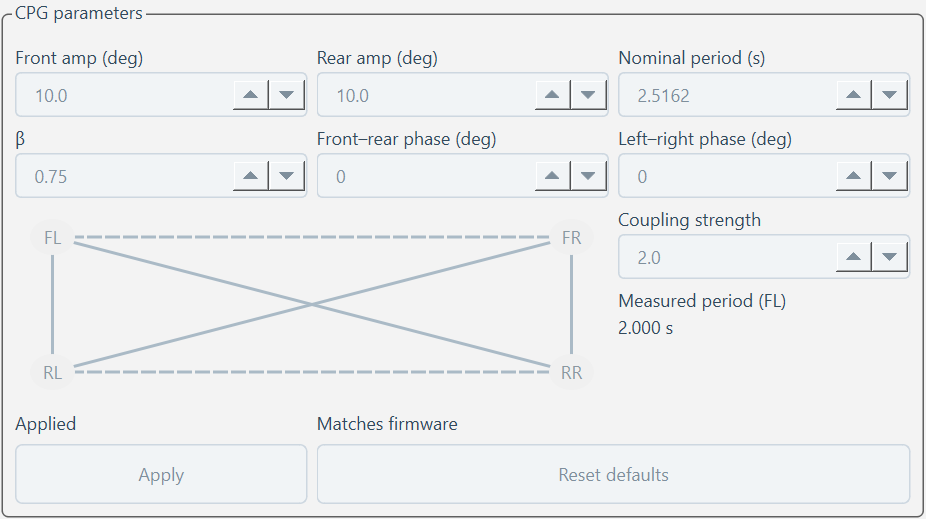

# Proportional gamepad control

Deploy Firmware, Pi gateway and Console from the same release together. The
Console enables proportional control after receiving schema2 motion telemetry
and a CPG snapshot with `feature_level >= 2`; Hello capabilities remain zero.
Old schema1 telemetry and CSV remain readable. No feature negotiation is added.

## Wire contract

StartProportional is an ordinary ACKed command: MCU Protocol V2 type `0x1B`,
RBRP CommandRequest robot command kind `0x0C`. Its nine-byte payload is four
little-endian u16 configuration fields followed by a u8 session ID:

| Offset | Field | Unit | Default | Range |
| --- | --- | --- | --- | --- |
| 0 | max_scale | 0.001 | 1000 | 100–1000 |
| 2 | turn_gain | 0.001 | 1000 | 0–2000 |
| 4 | pitch_limit | centidegrees | 1000 | 0–2000 |
| 6 | common slew | 0.001 normalized units/s | 2000 | 100–10000 |
| 8 | session_id | u8, natural wrap | — | 0–255 |

ProportionalInput is MCU type `0x1C`, RBRP kind `0x06` with request_id zero.
It has no ACK, ordinary pending correlation or command deduplication:

| Offset | Field | Encoding |
| --- | --- | --- |
| 0 | session_id | u8 |
| 1 | sequence | LE u16, natural wrap |
| 3 | throttle | LE u16, 0–1000 |
| 5 | turn | LE i16, −1000–1000 |
| 7 | pitch | LE i16, −1000–1000 |

The first sequence is accepted; later sequences advance by 1–32767 modulo
65536. Wrong sessions, duplicate and stale sequences do not refresh the timeout.
Console, gateway and LinkCore each overwrite one latest value. Existing ordinary
STOP, Disable, authority revocation and session abort clear the slots; STOP
transmission priority and physical ramp are unchanged.

## Motion and operator rules

Start requires STOPPED, a live heartbeat and all five servos enabled with a known
logical pose. All three gait backends sample Forward and apply common side
scaling: `a = clamp(turn_gain * turn, -1, 1)`,
`left = max_scale * throttle * (1 + min(a, 0))`,
`right = max_scale * throttle * (1 - max(a, 0))`.
FrontAxis bias is `-pitch_limit * pitch`. Turn with zero throttle does not rotate
in place. Throttle, turn and pitch share the configured normalized slew.

An accepted Start enters RUNNING at zero demand. More than 600 ms without a
valid newer input invokes the existing 750 ms normal STOP and retains servo
enable. The independent existing 500 ms heartbeat fail-safe still disables
servo power. STOP, Disable and faults invalidate the proportional session.
Schema2 remains 35 bytes per sample and reports effective values and stop reason.

Opening Gamepad and every proportional STOP require observing all four axes
centered once with B released. During Start ACK wait input is ignored. Left Y
positive controls throttle; right X controls turning and right Y controls pitch;
left X participates only in the center gate. The deadzone/gamma map is
`sign(x) * (max(0, (abs(x)-d)/(1-d)))^gamma` with defaults `d=0.15`, `gamma=1.5`.
Both sticks returning to zero immediately STOP. B invokes STOP on its press edge,
including while Gamepad is disconnected if control authority is held.
Mode and configuration changes require Gamepad disconnected and motion STOPPED.

Existing depth thresholds and hysteresis are retained. Surface blocks positive
pitch, SoftFloor blocks negative pitch, and unavailable/unzeroed depth blocks
pitch. Forbidden actual telemetry pitch causes STOP; HardLimit also disconnects
Gamepad. Manual controls stop an active proportional session before a subsequent
new manual request. Configuration CSV events contain numeric values directly.

## Measured-period presentation

PR-1 C/C++ additions were formatted in a separate token-identical commit before
implementation. The Measured period value now shares a vertical cell with its
label and starts directly below it. This screenshot comes from the existing
Qt preview with a fake controller and a synthetic 2.000 s period; it is UI
evidence, not a physical measurement.

