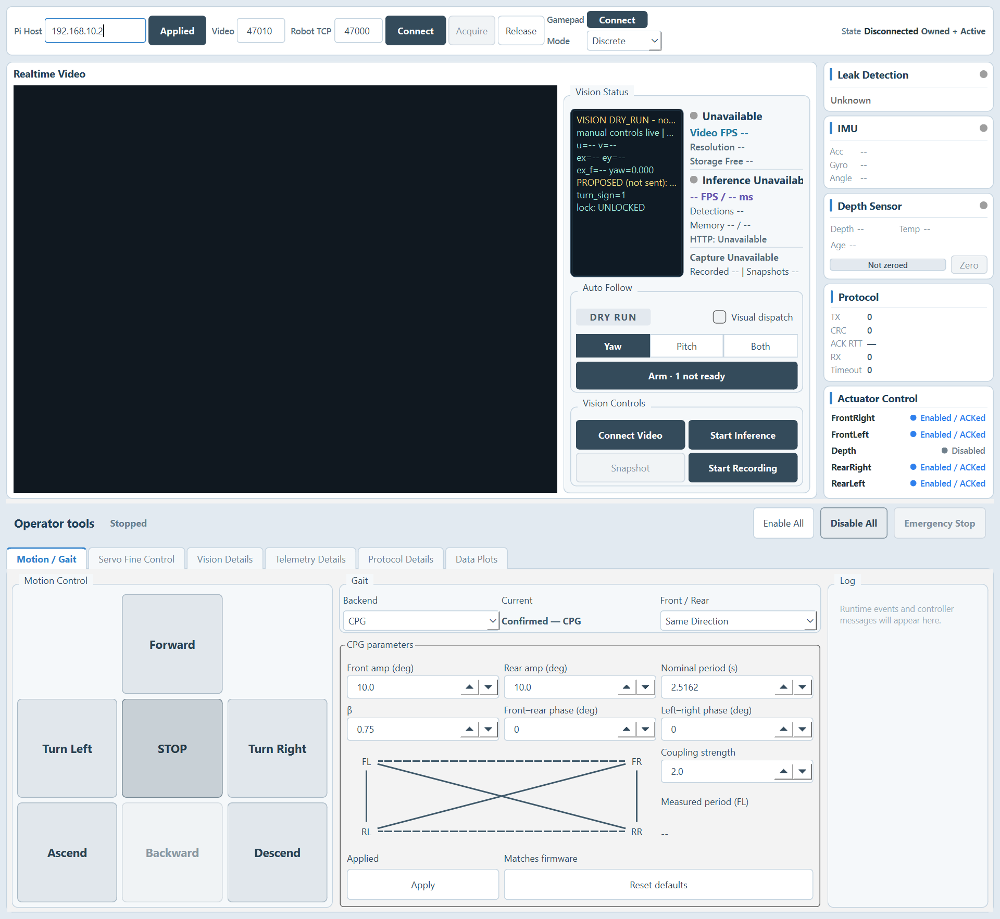
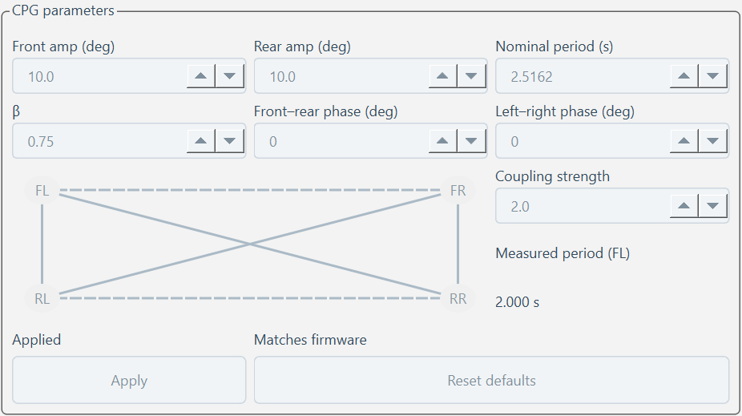
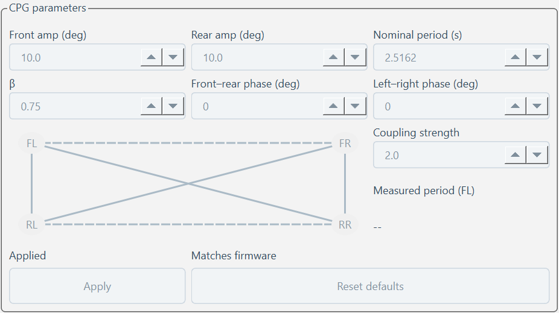
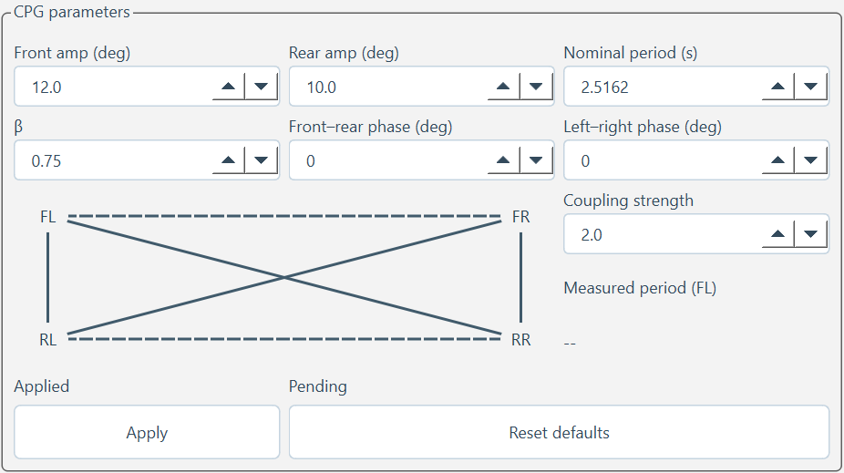
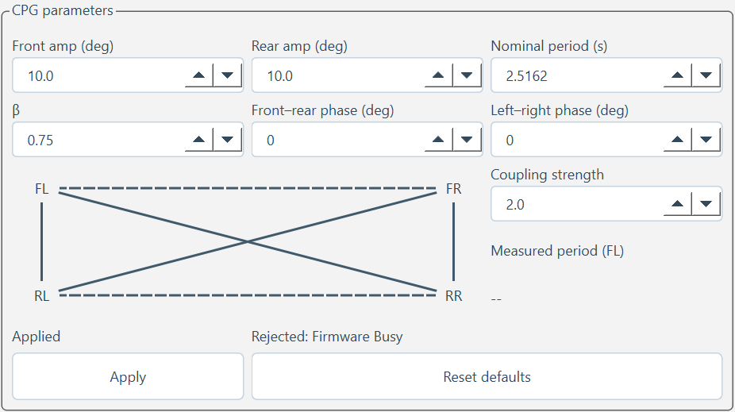

# CPG parameters (Task 19, PR-1)

Parameters are stored in RAM and accepted only while Motion is STOPPED. Resetting
the motion generator preserves them; MCU reboot restores the production defaults.
SimpleGait, CPG and Experimental Flex remain available. Front / Rear still flips
the rear stroke direction independently of oscillator phase offsets.

## Parameters and wire format

`P` is 58 bytes: schema `u8 = 1`, coupling mask `u8`, then seven little-endian
IEEE-754 binary64 values in this order. Non-finite and out-of-range values are
rejected. Default period is transmitted without decimal quantization.

| Parameter | Default | Range | Unit |
|---|---:|---:|---|
| Front amplitude | 10 | 0–28 | deg |
| Rear amplitude | 10 | 0–30 | deg |
| Nominal period | 2.5162 | 0.5–10 | s |
| Beta | 0.75 | 0.1–0.9 | fraction |
| Front–rear phase F | 0 | −180–180 | deg |
| Left–right phase L | 0 | −180–180 | deg |
| Coupling strength | 2 | 0–5 | weight |

Mask bits 0–5 select the bidirectional pairs FL–FR, RL–RR, FL–RL, FR–RR,
FL–RR, FR–RL. Default `0x3C` preserves the existing ring. Node offsets in
core order `[FR, RR, RL, FL]` are `[L, F+L, F, 0]`; each directed edge uses
`target offset − source offset`. The existing front amplitude sign is retained.

| Layer | Message | Payload |
|---|---|---|
| MCU | Set `0x18` | P (58 B), ordinary ACK |
| MCU | Query `0x1A` | empty, ordinary ACK |
| MCU | Snapshot `0x24` | request sequence u16, version u16, feature level u8, P (63 B) |
| RBRP | Command kind `0x0A` | P after command kind (59 B) |
| RBRP | Command kind `0x0B` | query, command kind only (1 B) |
| RBRP | Telemetry `0x8B` | epoch u32, Pi RX ms u64, MCU snapshot (75 B) |

Accepted Set and Query each produce one snapshot. Acquire triggers one Query.
Only a matching accepted Set and snapshot confirm application; no automatic retry
or extra capability negotiation is added. Parameter version is u16 and wraps
naturally; an identical Set leaves it unchanged. PR-1 feature level is 1.

## Motion telemetry and recording

The production MCU always sends motion schema2: the existing 16-byte header and
one 35-byte sample (51-byte payload). The original 22 sample bytes are preserved;
the 13-byte extension is control mode u8, stop reason u8, parameter version u16,
effective throttle u8 / turn i8 / pitch i8 (percent units), and FR/RR/RL phase u16.
FL remains at its original sample offset 14. PR-1 uses Discrete and zero effective
proportional values. Samples retain the original backend/state validity flags.

CSV v2 preserves the original 34 columns and appends record type, actual control
fields, four phases and parameter values. Each new parameter version gets one
`cpg_parameters` event row. These rows have no MCU sample timestamp and are
excluded from Task 17 clock/gyro processing. Existing v1 CSV remains readable;
live mixed-version deployment is unsupported.

Measured period uses FL phase wrap times while CPG is RUNNING with unchanged
parameters. It discards the first complete cycle and averages the most recent
three intervals; no five-second cutoff is used.

## UI and release boundary

The English A′ layout places Backend / Current / Front / Rear above the CPG
panel. Click a coupling line away from the diagonal crossing to toggle its pair.
Apply requires active authority and STOPPED; readback shows Matches firmware,
Pending or Rejected. Reset defaults edits the panel without sending a command.
Ascend / Descend are in the 3×3 motion area; Backward remains disabled.
Gamepad Mode defaults to Discrete; Proportional is disabled until PR-2.

Firmware, gateway and Console must be deployed and rolled back together. Hello
caps remain zero. This PR does not change motion/visual safety policy, flash
parameters, deploy the gateway, flash the MCU, operate hardware or merge the PR.

Four frozen Same/Opposite traces (with and without Apply defaults) verify exact
default output across startup, switches, STOP and restart. Fixture provenance is
in `RoboBeetleFirmware/tests/fixtures/task19_default_traces.md`.

## Real Qt previews

Generated with `operator_console_preview --cpg-parameters`, Qt 6.11.2 Windows
QPA, a fake controller and zero robot control writes. The full content height is
larger than short screens; the existing startup policy requests maximization.
No hardware or real robot connection is used by these previews.

| RUNNING: editing disabled, measured FL period | Other backend: CPG disabled |
|---|---|
|  |  |

| Local edit awaiting Apply | Firmware rejection |
|---|---|
|  |  |
